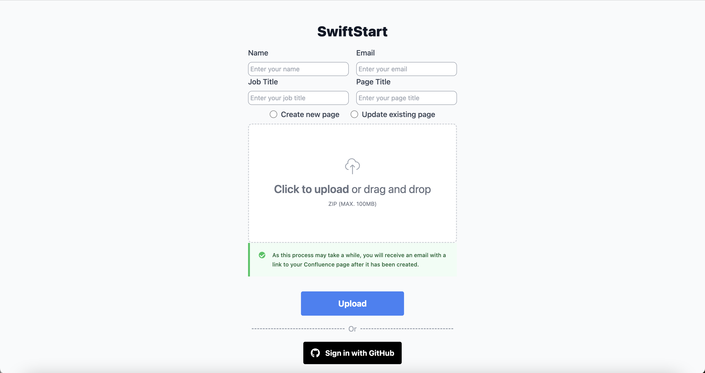
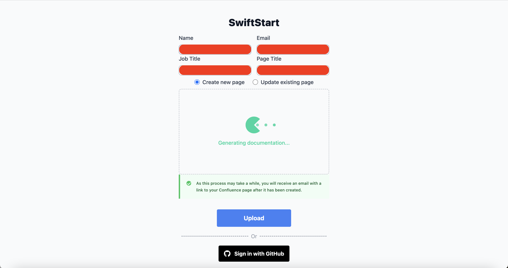
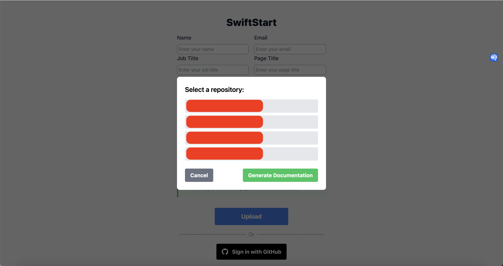

# SwiftStart Frontend
## Inspiration
Have you ever found yourself struggling to comprehend a codebase due to its complexity or its ["spaghetti-like"](https://vulcan.io/blog/what-is-spaghetti-code-and-why-is-it-a-problem/) structure? We know how frustrating it can be to decipher poorly documented legacy code, and we understand that this struggle is not unique to developers alone. Sales teams, project managers, and professionals from all walks of life face similar challenges when it comes to understanding codebases. That's why we envision **a product that empowers anyone, regardless of their programming background, to grasp a codebase's high-level functionalities**. 

## What it does
1. **File upload** (only supports `.zip` files)
   1. Drag and drop
   2. Upload using a button
   3. **Authenticate with Github** and select a repository of your choice
2. **Automatic documentation generation** in Markdown format
3. Integrated with Confluence to **easily view and export generated documentation**
4. Integrated with Twilio to send **email notifications** to a user once the documentation has been generated

## How we built it
We used a React frontend to provide an intuitive User Interface (UI) for users to effortlessly provide their personal details and to upload their repositories. These information is then sent over a secure TLS connection to a Flask backend which handles all the other API calls - openAI's GPT3.5, Twilio, Confluence and Github. When the documentation generation by GPT is completed, it is converted into Markdown. This Markdown file is used to dynamically generate a new Confluence page or update an existing Confluence page, depending on the user's input. Finally, after the relevant Confluence page is created or updated, we leverage Twilio to send the user an email notification.

To provide more options, we also integrated with Github API so that users do not need to download a separate `.zip` file for every repository they have. Instead, after signing into Github, users can simply select their repository of choice and we will leverage Github API to read the repository's contents to generate a documentation page accordingly. This is subsequently used to create or update a Confluence page too. Finally, an email notification will be sent to the email address linked to the user's Github account.

## Challenges we ran into
- It was exceedingly difficult to get GPT to reliably produce the results we wanted/needed. This was largely due to the fact that we had to make our context as concise as possible to minimise cost and fit our context within the token constraints imposed by OpenAI
- As this was our first time integrating with all of the different third party APIs mentioned above, we invested a significant proportion of time reading and internalising the relevant documentation
- Github marketplace was new to all of us
- Initially, we wanted to produce a high-level solutions architecture diagram for each repository uploaded using PlantUML. However, this soon proved to be exceedingly tedious because of the large amounts of context it requires. With the existing limitations of GPT, the diagram generated lacked sufficient details to be of use. Hence, we decided to shelf this idea for now.

## Accomplishments that we're proud of
- Creating our dream of automatic documentation
- Bridging the gap between the tech and non-tech crowd and empowering everyone to be more productive and efficient
- Collaborating effectively as a team, we were able to efficiently break down this large project into manageable chunks

## What we learned
- The limitations of GPT
- The difficulty of reading documentation to reliably integrate with third party APIs
- How to use many more third-party APIs including Github, Atlassian (Confluence), Twilio
- How to build a Github application
- How to dynamically create a Confluence page using custom HTML

## What's next for SwiftStart
1. In order to improve reliability and accuracy, we aim to **integrate with more office productivity tools** such as Microsoft 365, Slack, Jira, Postman, Google Workspace, Notion, Stoplight, Docusaurus
2. To better contextualise the documentation generated, we aim to **introduce more variables into our prompts**. For instance, we hope to allow the user to incorporate his / her job title. If the user is a software engineer, this would allow us to generate documentation with more technical terms. On the flipside, if the user is in a non-technical role, we can customise our prompt to generate documentation with less technical terms.
3. For a better user experience, we aim to **revamp our user interface** too
4. To provide even deeper insights, we aim to **produce a high-level solutions architecture diagram for each repository uploaded** using PlantUML in future.